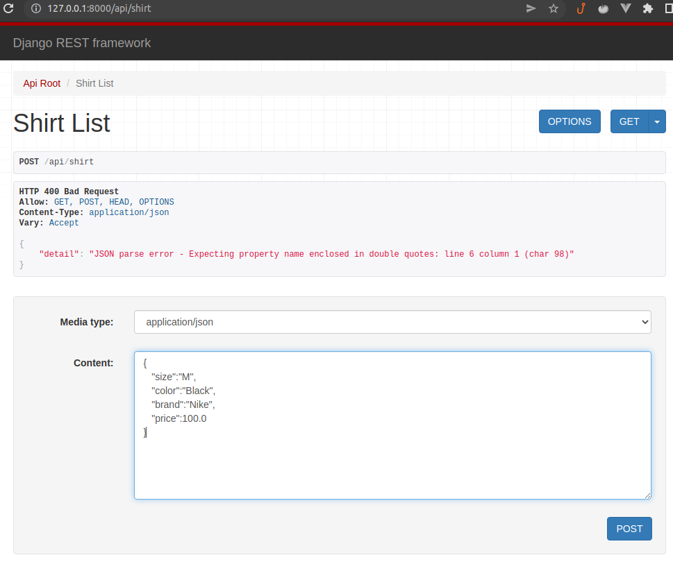
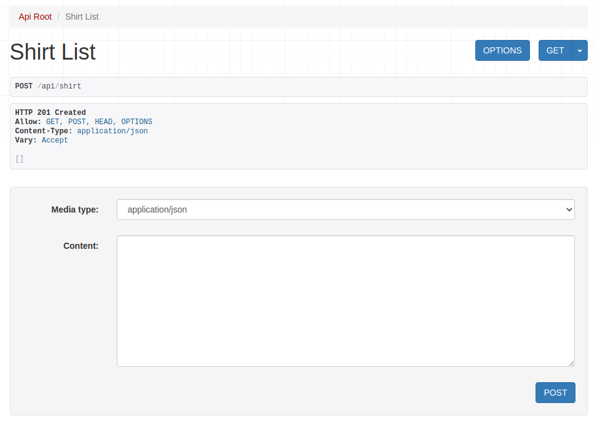
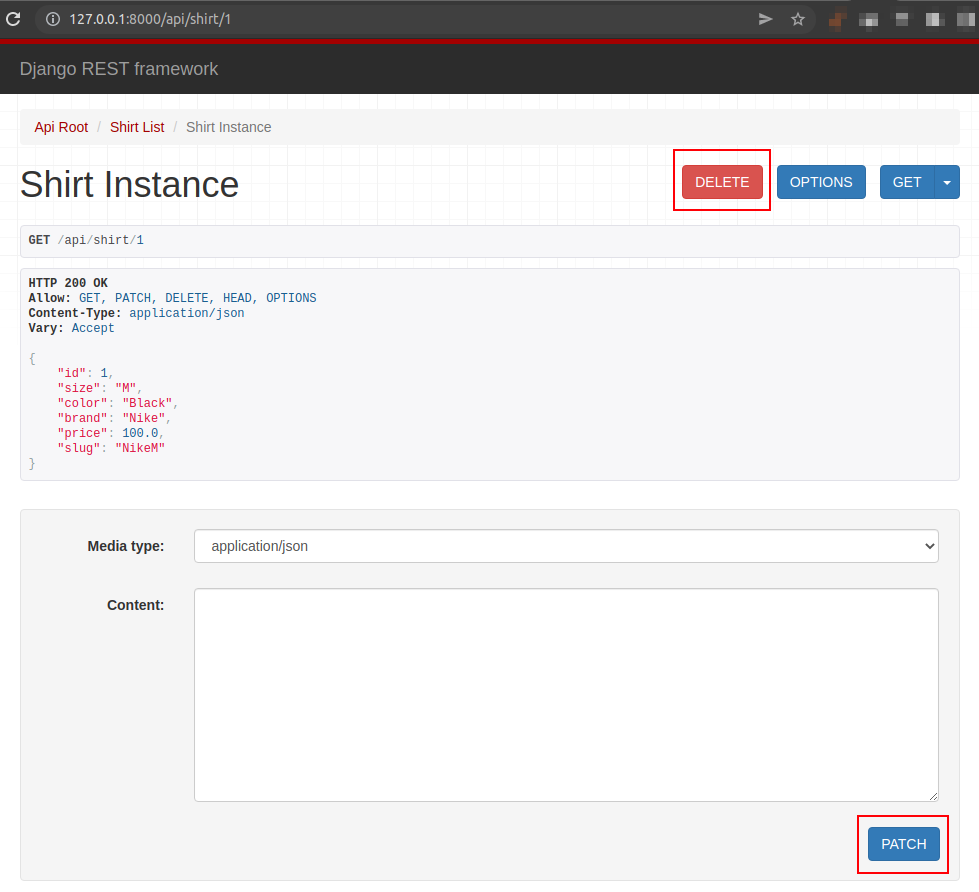

# Automation Store

## Install and Run

```shell
# Run this command to create a virtual environment and install requirements
$ make install

# Activate the virtual environment created:
$ source venv/bin/activate

# Run the project
$ make run
```
## Considerations about the solution:
We choice for our fashion-related resource a Shirt.

## Frontend to API
The Django Rest Framework disponibilize a web interface to access endpoints created:

- List shirt: http://127.0.0.1:8000/api/shirt


- Post a shirt: http://127.0.0.1:8000/api/shirt





- Delete or update a shirt: http://127.0.0.1:8000/api/shirt/1



## TODO
### Specification
- [V] API to Create fashion-related resource.
- [V] API to Retrieve fashion-related resource.
- [V] API to Update fashion-related resource.
- [V] API to Delete fashion-related resource.
- [V] Create a frontend to the API.
- [V] Provide a way for us to run your application locally with all of its' requirements.
    - [ ] An alternative is to host it somewhere we can interact with the API and frontend.
- [ ] It would be great to document the steps required to that on the README.
- [ ] Create an endpoint to populate data into the model/table using a CSV file.
- [ ] One of the fields of the model/table must have its' value calculated based on 1 or more of the other ones.

### Steps
- [ ] Create a branch from `master` (e.g. `develop`) and do all of your magic on this created branch

### What will be evaluated
- [ ] Data sanitization and validation
- [ ] API documentation.
- [ ] Automated tests
- [ ] Code consistency

### **You will stand out from the crowd if**:
- [ ] You handle the documentation with love and care
- [ ] The frontend consumes ALL the backend API endpoints of the resource,
- [ ] You use Docker.